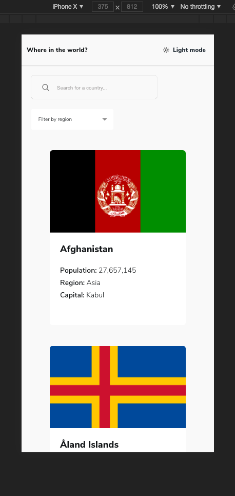

# Frontend Mentor - REST Countries API with color theme switcher solution

This is a solution to the [REST Countries API with color theme switcher challenge on Frontend Mentor](https://www.frontendmentor.io/challenges/rest-countries-api-with-color-theme-switcher-5cacc469fec04111f7b848ca). It is not pixel perfect.

## Table of contents

- [Overview](#overview)
  - [The challenge](#the-challenge)
  - [Screenshots](#screenshots)
  - [Links](#links)
- [My process](#my-process)
  - [Built with](#built-with)
- [Author](#author)


## Overview

### The challenge

Users should be able to:

- See all countries from the API on the homepage
- Search for a country using an `input` field
- Filter countries by region
- Click on a country to see more detailed information on a separate page
- Click through to the border countries on the detail page
- Toggle the color scheme between light and dark mode *(optional)*

### Screenshots





### Links

- Solution URL: [https://github.com/jundymek/rest-countries-vue](https://github.com/jundymek/job-listings-vue)
- Live Site URL: [https://jundymek.github.io/rest-countries-vue/](https://jundymek.github.io/job-listings-vue/)

## My process

### Built with

- Semantic HTML5 markup
- SCSS
- Flexbox
- Grid
- [Vue.js](https://v3.vuejs.org/) - JS library
- Typescript
- [restcountries API](https://restcountries.eu) - API


### What I learned

Vue composition API - it is magical. Almost full logic in this little hook (composable).

```js
import { computed, Ref, ref } from "vue";

interface Currency {
  code: string;
  name: string;
  symbol: string;
}

interface Language {
  iso639_1: string;
  iso639_2: string;
  name: string;
  nativeName: string;
}

export interface CountryType {
  name: string;
  nativeName: string;
  population: number;
  region: string;
  subregion: string;
  capital: string;
  topLevelDomain: string;
  currences: Currency[];
  languages: Language[];
  borders: string[];
  flag: string;
  alpha3Code: string;
}

export interface CountryCodesType {
  [key: string]: string;
}

const countries = ref<CountryType[] | undefined>(undefined);
const country = ref<CountryType | undefined>(undefined);
const countryCodes = ref<CountryCodesType | undefined>(undefined);
const filteredCountries = ref<CountryType[] | undefined>(undefined);
const error = ref("");
const isLoading = ref(false);

export const useGetCountry = (): {
  error: Ref<string>;
  isLoading: Ref<boolean>;
  countries: Ref<CountryType[] | undefined>;
  country: Ref<CountryType | undefined>;
  countryCodes: Ref<CountryCodesType | undefined>;
  getAllCountries: () => Promise<void>;
  getCountriesByRegion: (region: string) => Promise<void>;
  getCountryByName: (country: string) => Promise<void>;
  filteredCountries: Ref<CountryType[] | undefined>;
} => {
  const getAllCountries = async () => {
    if (isLoading.value) return;
    isLoading.value = true;

    try {
      const response = await fetch(
        "https://restcountries.eu/rest/v2/all?fields=name;nativeName;population;region;subregion;capital;topLevelDomain;currencies;languages;borders;flag;alpha3Code"
      );
      const data = await response.json();
      isLoading.value = false;
      countries.value = data;
      filteredCountries.value = data;
      createCountryCodes();
    } catch (error) {
      console.log(error);
      isLoading.value = false;
    }
  };

  const getCountriesByRegion = async (region: string) => {
    if (!region.length) {
      filteredCountries.value = countries.value;
      return;
    }
    if (isLoading.value) return;
    isLoading.value = true;

    try {
      const response = await fetch(
        `https://restcountries.eu/rest/v2/region/${region}`
      );
      const data = await response.json();
      isLoading.value = false;
      countries.value = data;
      filteredCountries.value = data;
    } catch (error) {
      console.log(error);
      isLoading.value = false;
    }
  };

  const getCountryByName = async (countryName: string) => {
    if (isLoading.value) return;
    isLoading.value = true;

    try {
      const response = await fetch(
        `https://restcountries.eu/rest/v2/name/${countryName}?fields=name;nativeName;population;region;subregion;capital;topLevelDomain;currencies;languages;borders;flag;alpha3Code`
      );
      const data = await response.json();
      isLoading.value = false;
      country.value = data;
    } catch (error) {
      console.log(error);
      isLoading.value = false;
    }
  };

  const createCountryCodes = () => {
    const borders: CountryCodesType = {};
    if (countries.value) {
      for (const key of countries.value) {
        borders[key.alpha3Code] = key.name;
      }
    }
    countryCodes.value = borders;
  };

  return {
    error,
    isLoading: computed(() => isLoading.value),
    countries,
    country,
    getAllCountries,
    getCountriesByRegion,
    getCountryByName,
    filteredCountries,
    countryCodes,
  };
};

```

## Author

- Website - [https://jundymek.com](https://jundymek.com)
- Frontend Mentor - [@jundymek](https://www.frontendmentor.io/profile/jundymek)
- Github - [jundymek](https://github.com/jundymek)

